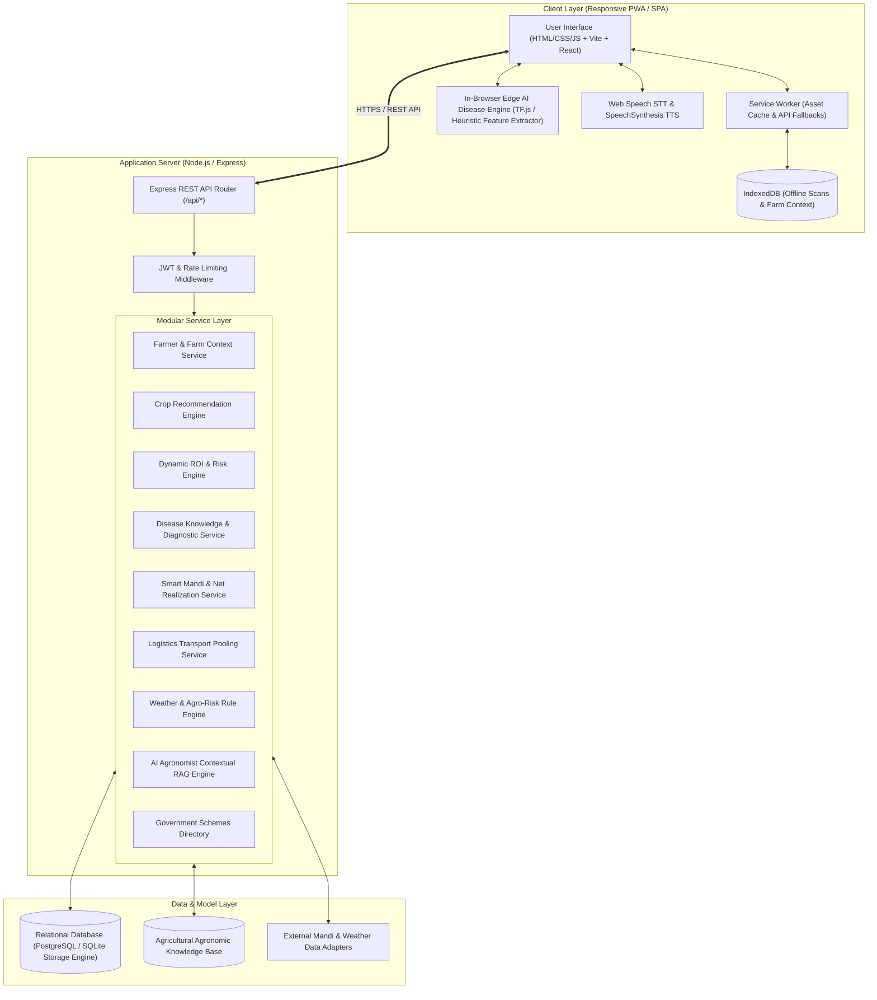
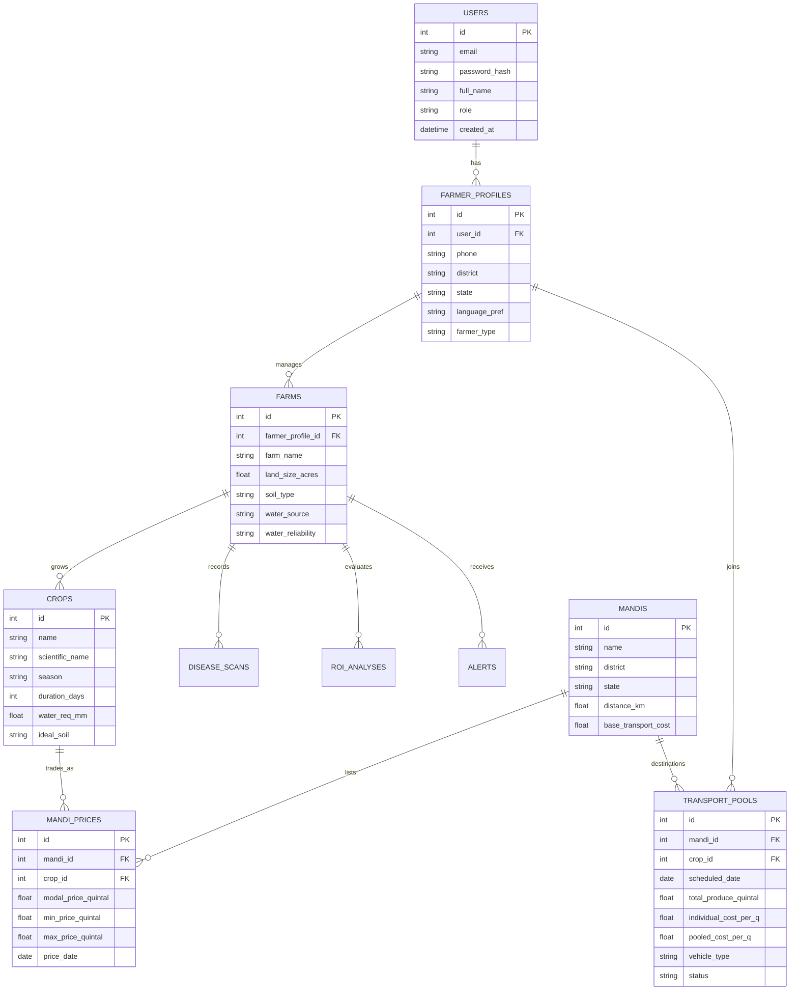
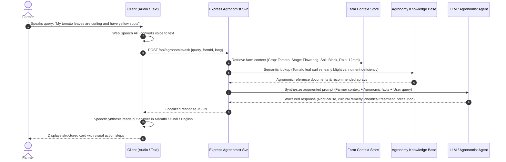

# System Architecture & Technical Specification
## Smart Farmer Assistance System (SFAS)

**Version:** 1.0.0  
**Authors:** Yash Bawane, Rohit Kundu, Manthan Takerkhede  

---

## 1. High-Level Architecture Overview

SFAS is designed using a decoupled client-server architecture with an emphasis on local edge intelligence and offline resilience:



---

## 2. Frontend Architecture

### 2.1 Technology & Design Framework
- **Core:** Modern React (Vite-powered) with pure standard HTML5 semantic architecture and custom Vanilla CSS.
- **Styling Architecture:** Tailored CSS custom properties (`variables.css`), high-contrast color tokens, fluid typography using `clamp()`, and scoped component styling (`components.css`).
- **Typography:** Google Fonts pairing:
  - Editorial Serifs: `Fraunces` / `Newsreader` for impactful headings and storytelling.
  - Functional Sans: `Manrope` / `Source Sans 3` for forms, touch targets, and financial data grids.
- **Color Palette (Earth & Crop Editorial):**
  - Canvas: Warm Cream (`#FDFBF7`), Surface Light (`#F7F4EE`), Card Border (`#E7E2D6`).
  - Primary: Deep Forest Green (`#1B382B`), Dark Olive (`#2D4A3E`).
  - Accent / Risk: Wheat Gold (`#D4A373`), Leaf Green (`#4A7C59`), Terracotta Red (`#C85A32`).
  - Text: Earth Charcoal (`#1F2421`), Muted Earth (`#5A645D`).

### 2.2 Component Hierarchy
```
src/
├── components/
│   ├── layout/
│   │   ├── Navbar.jsx           # Editorial desktop header with status badges
│   │   ├── MobileNav.jsx        # Thumb-friendly bottom navigation bar
│   │   └── Footer.jsx           # Institutional & team footer
│   ├── common/
│   │   ├── OfflineBadge.jsx     # Network state indicator with sync status
│   │   ├── LanguageSwitcher.jsx # One-click regional language toggle
│   │   ├── AudioSpeaker.jsx     # Read-aloud button for accessibility
│   │   └── NotificationToast.jsx# Contextual feedback alerts
│   ├── decision/
│   │   ├── GuidedOptionPicker.jsx # Visual touch cards for soil, water, stage
│   │   ├── RoiComparisonCard.jsx  # Multi-variable ROI & risk breakdown
│   │   └── CropCard.jsx           # Crop season and agronomic badge
│   ├── protection/
│   │   ├── DiseaseScanModal.jsx   # Camera capture, preview & analysis
│   │   ├── DiseaseResultCard.jsx  # Severity, confidence, biological/chemical Rx
│   │   └── PreventativeAlertCard.jsx # Humidity/rain rule-driven warnings
│   ├── market/
│   │   ├── MandiNetRealizationCard.jsx # Price minus transport math visualizer
│   │   ├── PriceTrendChart.jsx         # 7-day modal price curve
│   │   └── TransportPoolModal.jsx      # Nearby farmer pooling calculator
│   └── agronomist/
│       ├── VoiceMicButton.jsx     # Big ripple microphone with STT listener
│       └── ChatMessageStream.jsx  # RAG-grounded agronomist dialogue
```

---

## 3. Backend Architecture

The backend is built with Express following a strict **Controller-Service-Model** pattern to ensure testability and separation of concerns:

```
server/
├── config/
│   └── database.js          # Unified DB connector (SQLite for local zero-config / Postgres compatible)
├── controllers/
│   ├── authController.js    # Register, login, profile management
│   ├── cropController.js    # Recommendation & ROI calculation
│   ├── diseaseController.js # Disease image validation & diagnostic advice
│   ├── mandiController.js   # APMC rates & transport net realization
│   ├── alertController.js   # Agro-meteorological risk evaluation
│   └── agronomistController.js # Multilingual RAG conversational pipeline
├── services/
│   ├── cropAdvisorService.js
│   ├── roiCalculatorService.js
│   ├── diseaseDetectionService.js
│   ├── smartMandiService.js
│   ├── weatherService.js
│   ├── alertRuleEngine.js
│   ├── agronomistRagService.js
│   └── governmentSchemeService.js
├── models/
│   ├── schema.sql           # Canonical relational SQL schema
│   ├── db.js                # Database abstraction methods
│   └── seedData.js          # Authentic Indian agricultural data
├── middleware/
│   ├── authMiddleware.js    # JWT token verification
│   ├── rateLimiter.js       # Abuse prevention
│   └── errorHandler.js      # Graceful HTTP error responses
└── index.js                 # Server bootstrapping
```

---

## 4. Relational Database Schema



---

## 5. AI & Edge AI Architecture

### 5.1 Offline Edge AI Disease Detection
1. **Camera / Upload Pipeline:** Farmers capture leaf lesions directly in the field.
2. **Client-side Feature Extraction & Inference:** A browser-based inference runner analyzes visual indicators (color distribution, lesion edge morphology, necrosis patterns).
3. **Graceful Degradation:** When offline, inference executes entirely on device without cloud roundtrips. Diagnostic reports and leaf image signatures are stored in `IndexedDB`.
4. **Cloud Synchronization:** When connectivity resumes, the Service Worker triggers an asynchronous background sync to log the incidence report to the central epidemiological registry.

### 5.2 RAG (Retrieval-Augmented Generation) Agronomist Pipeline


---

## 6. Offline PWA & Data Synchronization

- **Service Worker (`sw.js`):** Intercepts fetch requests, serves precached static assets via a **Cache-First** strategy, and wraps API queries in a **Network-First with Offline Fallback** strategy.
- **IndexedDB Store:**
  - `offlineScans`: Unsynced disease images, preliminary results, and timestamps.
  - `cachedFarmProfile`: Active farm acreage, soil, and active crops.
  - `cachedPrices`: Last synced APMC price tables.
- **Liveness Monitor:** The `OfflineBadge` component listens to `navigator.onLine`, `window.online`, and `window.offline` events, updating UI feedback instantaneously.
